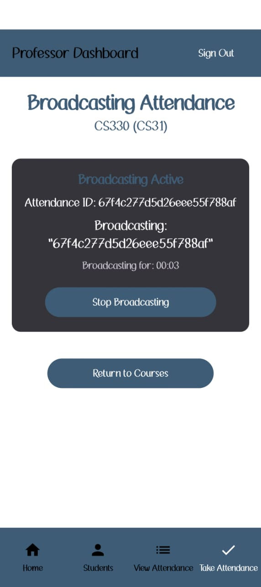
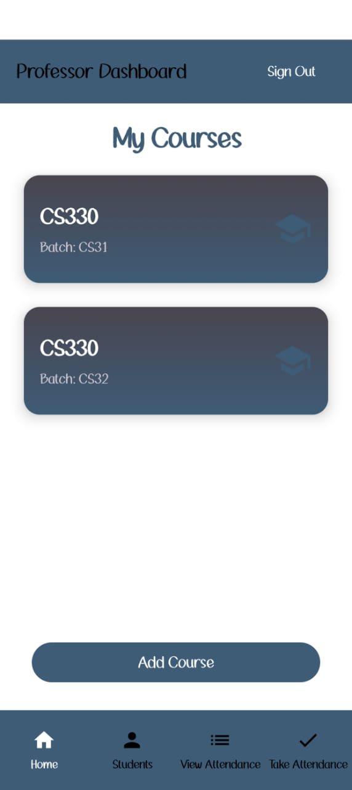
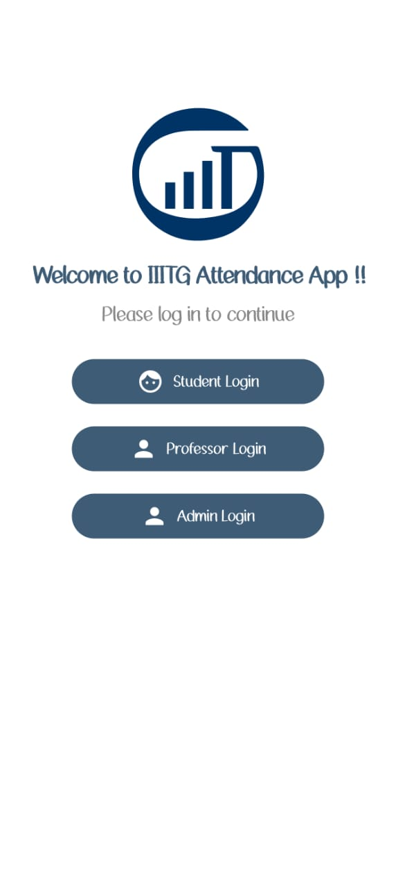
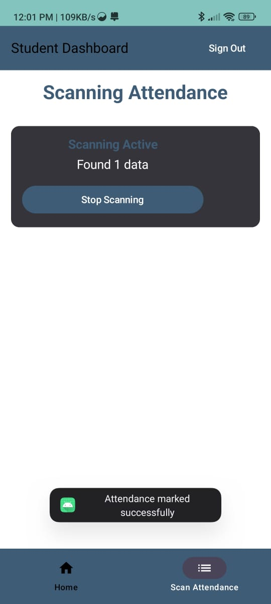

# Bluetooth Low Energy (BLE) Based Automatic Attendance System
<!-- First Row -->

    
    

    
    

## 🌟 Overview

This project presents a **secure and efficient automatic attendance system** designed to eliminate proxy attendance and streamline administrative processes in academic or corporate settings. By leveraging **Bluetooth Low Energy (BLE)** proximity sensing, multi-layered identity verification, and a robust cloud-based backend, this solution ensures accurate and tamper-proof presence recording.

The system utilizes a multi-role Android application (for Students, Professors, and Admins) that communicates with a Node.js server and a MongoDB database.

## 💡 Key Problem & Solution

### ❌ Traditional System Flaws

Traditional attendance methods (manual roll call, shared RFID cards, or fixed biometric hardware) are vulnerable to manipulation, hygiene concerns, and proxy attendance, leading to compromised academic integrity and administrative inefficiency.

### ✅ Solution: Proximity-Bound, Secure Attendance

The system solves this by creating a **context-aware, presence-verified, and identity-bound** attendance process:

1.  **Proximity Enforcement:** Professors broadcast a unique session ID via a short-range **BLE signal** for a limited time (45 seconds), ensuring students must be physically present within the classroom radius to detect it.

2.  **Identity Binding:** Student accounts are securely bound to their **Firebase biometric login**, **Android Device ID**, and **SIM Subscription ID**, making device sharing and impersonation virtually impossible.

3.  **Real-time Validation:** The backend performs immediate checks for enrollment status, session validity, and duplication before marking attendance.

## 🛠️ Technology Stack

| Component | Technology | Description |
| --- | --- | --- |
| Mobile App (Frontend) | Android (Kotlin) & Jetpack Compose | Multi-role application for Professor, Student, and Admin workflows. Built for performance and modern UI. |
| Backend API | Node.js (Express) | Handles business logic, authentication, and data validation. |
| Database | MongoDB (NoSQL) | Flexible, scalable data persistence for attendance records, courses, and user data. |
| Authentication | Firebase Authentication | Secure user credential management and unique user identification (UID). |
| Deployment | Serverless AWS Environment | Ensures high availability, scalability, and robustness. |
| Scheduled Jobs | node-cron | Used for automated archival of expired courses. |

## 🚀 Features

### Professor Workflow

*   **Create and Manage Courses:** Define course metadata, batches, and expiry dates.

*   **Initiate & Control Broadcast:** Start, stop, and resume a BLE broadcast for a session, securely embedding a unique session ID.

*   **Manual Override:** Manually update attendance for students who missed the BLE window.

*   **Reporting:** Export attendance logs in Excel format.

*   **Archiving:** Automatically transfer expired courses to a separate collection for historical audit.

### Student Workflow

*   **Course Enrollment:** Join courses using a secure, unique six-character course code.

*   **Secure Login:** Uses **biometric authentication** (fingerprint/face recognition) after initial login and device verification.

*   **Attendance Marking:** Scan for the BLE session ID broadcast and instantly mark attendance via the backend.

*   **Real-time Updates:** View attendance status immediately in a clutter-free interface.

### Admin Workflow

*   **Centralized User Management:** Exclusive ability to create and manage both Student and Professor accounts (via CSV bulk upload or manual entry) to prevent fraudulent self-registration.

*   **System Oversight:** View and manage all active and archived courses, audit historical logs, and monitor individual student attendance.

## 🔒 Security and Integrity Measures

Our system implements a strong multi-layered security model:

1.  **Identity Hard-Binding:** Verification against **Android ID** and **SIM Subscription ID** ensures a user account is tied to a single, pre-registered device.

2.  **Biometric Confirmation:** Secondary biometric check for login ensures the authenticated user is the one accessing the device.

3.  **BLE Packet Security:** Uses a custom, predefined **UUID** for packet filtering to prevent spoofing of the attendance signal.

4.  **Backend Validation:** Server-side checks for enrollment, session validity, and prevention of duplicate attendance entries.

## 💻 System Architecture

The flow utilizes a client-server model with BLE as the initial communication trigger:

1.  **Professor Starts Session:** Professor App sends `POST /startSession(course_id)` to the Backend. Backend returns `session_id`. Professor App broadcasts `BLE (UUID + session_id)`.

2.  **Student Scans:** Student App performs `startScan(UUID)`. Upon detection of a `session_id`, the Student App sends `POST /markAttendance(session_id, student_id)` to the Backend.

3.  **Backend Verifies:** The Backend validates the device, user ID, course enrollment, and checks for duplicates.

4.  **Attendance Marked:** The Backend updates the MongoDB record and sends a success status back to the Student App.

## 🤝 Acknowledgements

This project was developed with the guidance and support of the Indian Institute of Information Technology, Guwahati.
